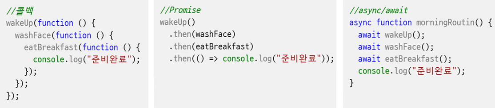

1. 비동기 실행
   비동기는 특정 코드의 실행이 완료될 때까지 기다리지 않고 다음 코드를 먼저 수행

```javascript
function wakeUp() {
  setTimeout(() => {
    console.log("1. 일어났어요! ⏰");
  }, 1000);
}

function washFace() {
  setTimeout(() => {
    console.log("2. 세수했어요! 💦");
  }, 1000);
}
//비동기 처리리
wakeUp();
washFace();
```

2. 동기식으로 처리하기 위해서 콜백함수 안에 실행

```javascript
function wakeUp() {
  setTimeout(() => {
    console.log("1. 일어났어요! ⏰");
    washFace();
  }, 2000);
}

function washFace() {
  setTimeout(() => {
    console.log("2. 세수했어요! 💦");
  }, 2000);
}

wakeUp();
```

2. 콜백함수  
   비동기 작업의 결과에 따라 다른 작업을 수행해야 할 때는 전통적으로 콜백 함수를 사용한다. 콜백 함수란 비동기 작업이 완료되면 호출되는 함수의 의미로서, 비동기 함수의 매개변수로 함수 객체를 넘기는 기법을 말한다. 하지만 콜백 함수를 사용하면 코드가 복잡하고 가독성이 떨어지는 문제가 있다.

```javascript
function wakeUp(callback) {
  setTimeout(() => {
    console.log("1. 일어났어요! ⏰");
    callback();
  }, 2000);
}

function washFace() {
  setTimeout(() => {
    console.log("2. 세수했어요! 💦");
  }, 2000);
}

function shower() {
  setTimeout(() => {
    console.log("2. 샤워했어요! 💦");
  }, 2000);
}

//wakeUp(washFace);
wakeUp(shower);
```

3. 콜백함수에 인수가 있는 경우 익명함수를 만들어서 그 안에서 함수를 직접 호출(래퍼함수)

```javascript
function wakeUp(callback) {
  setTimeout(() => {
    console.log("1. 일어났어요! ⏰");
    callback(1000);
  }, 2000);
}

function washFace(time) {
  setTimeout(() => {
    console.log("2. 세수했어요! 💦");
  }, time);
}
//콜백함수에 인자가 있는 경우 래퍼함수를 이용
//wakeUp(washFace(2000));
wakeUp(function () {
  washFace(1000);
});
```

3. 콜백지옥
   여러 개의 비동기 작업을 순차적으로 수행해야 할 때는 콜백 함수가 중첩되어 코드의 깊이가 깊어지는 현상이 발생한다. 이러한 현상을 콜백 지옥(callback hell) 이라고 부른다.

```javascript
function wakeUp(callback) {
  setTimeout(() => {
    console.log("1. 일어났어요! ⏰");
    callback();
  }, 2000);
}

function washFace(callback) {
  setTimeout(() => {
    console.log("2. 세수했어요! 💦");
    callback();
  }, 2000);
}

function eatBreakfast(callback) {
  setTimeout(() => {
    console.log("3. 아침 먹었어요! 🍞");
    callback();
  }, 1000);
}

wakeUp(function () {
  washFace(function () {
    eatBreakfast(function () {
      console.log("준비완료");
    });
  });
});
```

4 Promise 객체

```javascript
function wakeUp() {
  return new Promise((resolve, reject) => {
    setTimeout(() => {
      console.log("1. 일어났어요! ⏰");
      resolve();
    }, 2000);
  });
}

function washFace() {
  return new Promise((resolve, reject) => {
    setTimeout(() => {
      console.log("2. 세수했어요! 💦");
      resolve();
    }, 2000);
  });
}

function eatBreakfast() {
  return new Promise((resolve, reject) => {
    setTimeout(() => {
      console.log("3. 아침 먹었어요! 🍞");
      resolve();
    }, 1000);
  });
}

wakeUp()
  .then(washFace)
  .then(eatBreakfast)
  .then(() => console.log("준비완료"));
```

4 async/await

```javascript
async function morningRoutin() {
  await wakeUp();
  await washFace();
  await eatBreakfast();
  console.log("준비완료");
}
```


